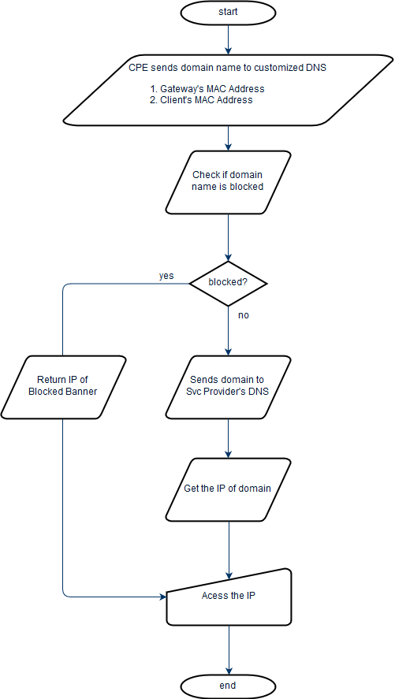

Advanced Parental Control
=========================

A sample DNS for Parental Control

This is a sample implementation to use DNS to return blocked or malicious websites for the purpose of **Parental Control**. It uses the [DNS library in Go](https://github.com/miekg/dns), and return the EDNS0 record per the query.

Purpose
=======

When doing Parental Control, we'd like to selectively control internet access
based on subscriber's client policy.

**Use Case 1**

According to trusted internet security authority,
website [www.gfxworld.ws](http://www.gfxworld.ws) contains illegal or phishing
information, organization would block this site for all the subscribers.

**Use Case 2**

Dad Christian finds website www.xyz.com contains unhealthy information for his
son Tom, he wants to block this site for Tom's iPad.

Solution
========

To achieve the purpose above, it's better to use DNS service to block the domain
that needs to access - mostly these domains are web sites.

It needs the CPE to cooperate with a customized DNS server, so the whole flow is
like this,



So the works are in two parts,

**CPE**

1.  Access the ParentalControl DNS before access Svc Provider's DNS
2.  Send RG's MAC address and client's MAC Address
    1.  Via EDNS ([RFC 6891](https://tools.ietf.org/html/rfc6891)) OPT code

**ParentalControl DNS**

1.  Check if the domain is malicious
2.  Check if the domain is blocked per Subscriber (RG)'s policy on client
    1.  Subscriber and Client are determined by MAC address

Experiment
==========

For ParentalControl DNS, there's no existing opensource DNS server implementation can meet
the requirement. Fortunately, there's a DNS framework in Go Lang that can easily
implement this customized DNS server.

A general DNS server can be a Authoritative server or a Recursive server,
-   An authoritative server defines the mapping between IP and zone info,
    -   e.g. 216.58.199.110 maps to google.com, any DNS query on *google.com*
        should comes to its authoritative server eventually.
-   A recursive server does not holds the IP and Zone mapping info, but it tries
    to reach other DNS server for an answer of the DNS query
    -   e.g. when the client query *google.com*, but the current DNS server does
        not have that info, it then forward the query to another DNS, (maybe a
        more creditable DNS).

**ParentalControl DNS**

The ParentalControl DNS does not have any IP to Zone mapping info. Since it should provide
the capability to interpret the blocked domains to a banner site, it is a
customized authoritative server that seems to have IP to Domain mapping, but
that IP is only the banner IP.

When the IP is not blocked, it should just return empty to tell the client it
does not have that info. The client should then query another DNS server (e.g.
SVC Provider's DNS) if any.

**MAC Address**

The subscriber's Gateway MAC address and Client MAC address are passed to DNS
server using EDNS protocol - [RFC 6891](https://tools.ietf.org/html/rfc6891).
-   Gateway MAC is encoded in **HEX** and put in **OPT** code **65001**
-   Client MAC is encoded in **HEX** and put in **OPT** code **65002**

Using **DiG 9.10.3 **it can support EDNS perfectly. e.g.
```
dig \@10.245.15.251 -p 1053 +ednsopt=65001:30383a30303a32373a39663a65323a6131
+ednsopt=65002:35363a38343a37613a66653a39373a3939 +norecurse google.com
```
PS: DiG command online reference - <http://www.manpagez.com/man/1/dig/>

**Implementation**

The source code is here
- [pcdns.go](pcdns.go).
Using [DNS Library in Go Lang](https://github.com/miekg/dns), a customized DNS
server is built. Just build it in Go Lang workspace with necessary libs.

Let's start the ParentalControl DNS for parental control on port 1053
```
./pcdns -port 1053
```
IP 192.168.200.1 is our banner IP - displaying banner info.

**Use Case 1 - Malicious web site**

When the client queries a malicious site, pcdns returns the banner IP
```
dig @10.245.15.251 -p 1053 +norecurse www.gfxworld.ws
; <<>> DiG 9.10.3-P4-Ubuntu <<>> \@10.245.15.251 -p 1053 +norecurse www.gfxworld.ws
; (1 server found)
;; global options: +cmd
;; Got answer:
;; ->>HEADER<<- opcode: QUERY, status: NOERROR, id: 1699
;; flags: qr; QUERY: 1, ANSWER: 1, AUTHORITY: 0, ADDITIONAL: 0

;; QUESTION SECTION:
;www.gfxworld.ws. IN A

;; ANSWER SECTION:
www.gfxworld.ws. 86400 IN A 192.168.200.1

;; Query time: 1 msec
;; SERVER: 10.245.15.251\#1053(10.245.15.251)
;; WHEN: Mon Aug 22 10:22:26 CST 2016
;; MSG SIZE rcvd: 64
```
In pcdns's log, it shows,
```
2016/08/22 10:22:26 DNS Request >
;; opcode: QUERY, status: NOERROR, id: 1699
;; flags: ad; QUERY: 1, ANSWER: 0, AUTHORITY: 0, ADDITIONAL: 1

;; QUESTION SECTION:
;www.gfxworld.ws. IN A

;; ADDITIONAL SECTION:

;; OPT PSEUDOSECTION:
; EDNS: version 0; flags: ; udp: 4096
2016/08/22 10:22:26 Domain www.gfxworld.ws. is detected malicious and blocked
```
**Use Case 2**

The subscriber's Gateway MAC is 
```
08:00:27:9f:e2:a1
```
The client (e.g. iPad) MAC is
```
56:84:7a:fe:97:99
```
S/he wants to block www.yahoo.com for the iPad client, then when iPad tries to
access the yahoo, the Gateway sends a request to ParentalControl DNS, here's a DiG's
imitation,
```
dig @10.245.15.251 -p 1053 +ednsopt=65001:30383a30303a32373a39663a65323a6131 +ednsopt=65002:35363a38343a37613a66653a39373a3939 +norecurse www.yahoo.com

; <<>> DiG 9.10.3-P4-Ubuntu <<>> @10.245.15.251 -p 1053 +ednsopt=65001:30383a30303a32373a39663a65323a6131 +ednsopt=65002:35363a38343a37613a66653a39373a3939 +norecurse www.yahoo.com
; (1 server found)
;; global options: +cmd
;; Got answer:
;; ->>HEADER<<- opcode: QUERY, status: NOERROR, id: 51788
;; flags: qr; QUERY: 1, ANSWER: 1, AUTHORITY: 0, ADDITIONAL: 0

;; QUESTION SECTION:
;www.yahoo.com. IN A

;; ANSWER SECTION:
www.yahoo.com. 3600 IN A 192.168.200.1

;; Query time: 1 msec
;; SERVER: 10.245.15.251#1053(10.245.15.251)
;; WHEN: Mon Aug 22 10:33:34 CST 2016
;; MSG SIZE rcvd: 60
```
The IP of banner is returned instead of yahoo's true IP. On pcdns, it shows
```
2016/08/22 10:33:34 DNS Request >
;; opcode: QUERY, status: NOERROR, id: 51788
;; flags: ad; QUERY: 1, ANSWER: 0, AUTHORITY: 0, ADDITIONAL: 1

;; QUESTION SECTION:
;www.yahoo.com. IN A

;; ADDITIONAL SECTION:

;; OPT PSEUDOSECTION:
; EDNS: version 0; flags: ; udp: 4096
; LOCAL OPT: 65001:0x30383a30303a32373a39663a65323a6131
; LOCAL OPT: 65002:0x35363a38343a37613a66653a39373a3939

2016/08/22 10:33:34 Gateway MAC address >08:00:27:9f:e2:a1
2016/08/22 10:33:34 Client MAC address >56:84:7a:fe:97:99
2016/08/22 10:33:34 Domain www.yahoo.com. is blocked under Gateway and Client's policy
```

Considerations
==============

The current implementation using [DNS Library in Go
Lang](https://github.com/miekg/dns) is pretty simple - just for demo purpose.
Moving forward, we can add more functionality,

-   A database of malicious website should be integrated from trusted source.
    (e.g. Symantec or McAfee)
-   Integration with NetValet so the subscriber's blocking rule can be
    customized.
-   An API interface to
    -   Update the malicious web sites
    -   Update rules subscriber
-   Improve the performance so that the query of a domain can be fast enough
    -   May set a benchmark to meet
